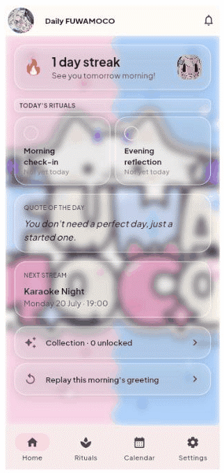
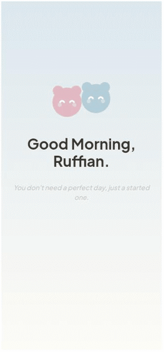

# Daily FUWAMOCO

## Screenshots



Full-bleed FUWAMOCO art/GIFs behind every screen, with a glassmorphism
treatment on top (blurred backdrop, translucent white wash, bright edge,
soft shadow) so the picture stays visible instead of getting boxed off.
Static screenshots below are from an earlier pass and don't reflect this
yet.



| | | |
|---|---|---|
|  Home |  Morning check-in |  Evening reflection |
|  Rituals (habits) |  Calendar |  Notifications |
|  Collection |  Settings | |

Daily FUWAMOCO is a cozy companion app inspired by FUWAMOCO and, especially,
Mococo's heartfelt pep talks that somehow always arrive at the right time.

I built this app for myself—a small place to start the day with a warm
greeting, hear a few encouraging words, keep a gentle streak, and share tiny
everyday rituals with two mascots that never ask me to be more productive,
only to keep going.

This isn't a habit tracker, a productivity tool, or a social platform. It's
a personal portfolio project exploring how comfort, kindness, and emotional
design can make software feel like a quiet companion rather than another
thing demanding your attention.

Built with Flutter, Riverpod, and go_router.

Inspired by [FUWAMOCO](https://www.youtube.com/channel/UCt9H_RpQzhxzlyBxFqrdHqA)
— [Fuwawa](https://hololive.hololivepro.com/en/talents/fuwawa-abyssgard/) and
[Mococo](https://hololive.hololivepro.com/en/talents/mococo-abyssgard/)
Abyssgard, hololive -Advent-. The abstract twin-blob mascot
(`lib/shared/widgets/companion_mascot.dart`) is original and is what draws
the small in-UI icons (nav bar, empty states). The full-bleed page
backgrounds are FUWAMOCO artwork/GIFs (`assets/fanart/`,
`assets/pic i just add/`) — a mix of my own fan art and reference images.

### Fan art

A few of my own FUWAMOCO pieces, just for fun:

  

## Features

- **Morning greeting** — once per calendar day, a short animated sequence
  (fade-in → text → voice clip → wallpaper → quote → streak/next stream),
  tap-to-skip, fails soft to visual-only if audio is unavailable.
- **Streak** — counts consecutive daily app opens.
- **Rituals (habit tracker)** — small recurring habits grouped by time of
  day, each with its own streak.
- **Calendar** — month view with an activity dot per day; tap a day to see
  what was done.
- **Morning check-in / Evening reflection** — a quick daily mood + note,
  independently completable.
- **Notifications** — in-app inbox, fires when your streak crosses a
  7/30/100-day milestone (no OS push — see [scope](docs/PRD-daily-fuwamoco-v2.md)).
- **Collection** — a small charm catalog; the Milestones group unlocks
  live from your streak.
- **Settings** — reduce motion, display name, greeting controls, and a
  "Reset my data" flow that returns the app to first-open state.
- **Glassmorphism visual pass** — every screen sits on a full-bleed
  FUWAMOCO photo/GIF; cards float on top as blurred, translucent glass
  rather than opaque boxes. A short character-GIF pop plays on every
  page transition (tab switch or pushed route).

Everything is local-only (`shared_preferences`) — no accounts, no backend,
works fully offline.

## Stack

- Flutter, Riverpod (`flutter_riverpod`), go_router
  (`StatefulShellRoute.indexedStack` for the bottom nav)
- Storage: `shared_preferences` — flat keys for settings, plus a small
  JSON-list helper (`lib/core/storage/json_list_store.dart`) for the
  mutable structured data (habits, notifications, daily entries)
- Audio: `just_audio`, manifest-driven local clips
- All content (quotes, wallpapers, schedule, prompts, the collection
  catalog) is bundled JSON — never hardcoded strings

## Run it

```powershell
flutter run -d chrome              # real browser window
flutter run -d web-server          # headless, serves on localhost
flutter test                       # logic + widget tests
```

No Android/iOS SDK setup was done for this project — it was built and
verified entirely against the web target.

## Docs

- [`docs/PRD-morning-companion.md`](docs/PRD-morning-companion.md) — the
  original v1 spec (the morning greeting feature).
- [`docs/PRD-daily-fuwamoco-v2.md`](docs/PRD-daily-fuwamoco-v2.md) — the
  v2 redesign's scope, architecture decisions, and what was deliberately
  left out (real push notifications, a personality picker, reminder times).
- [`CLAUDE.md`](CLAUDE.md) — working rules this project was built under.

## Status

Feature-complete for the scope above. Not under active development —
built as a design/engineering exercise, not a shipping product.
