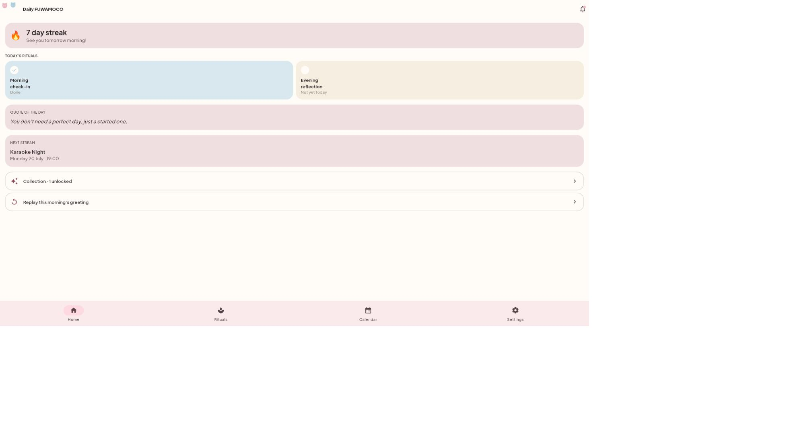
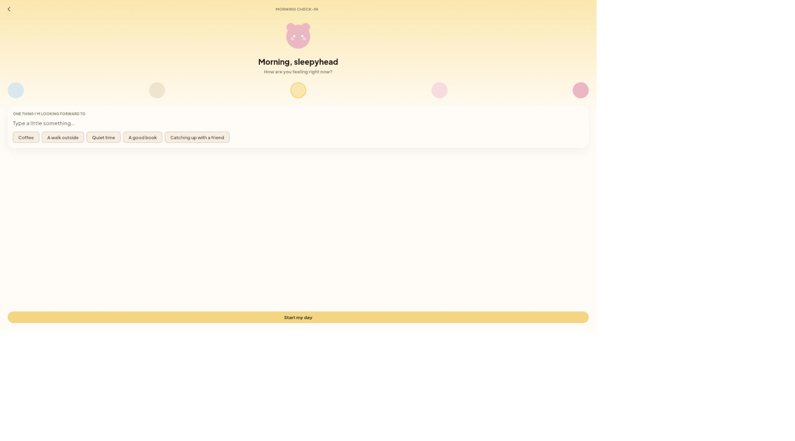
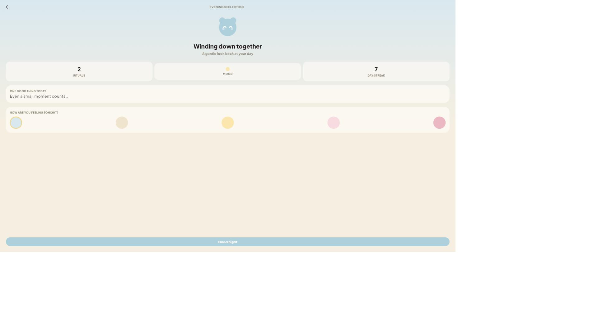
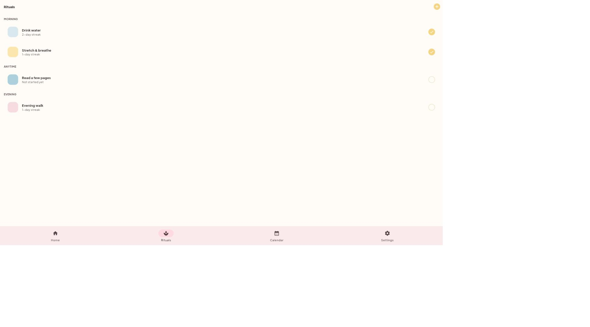
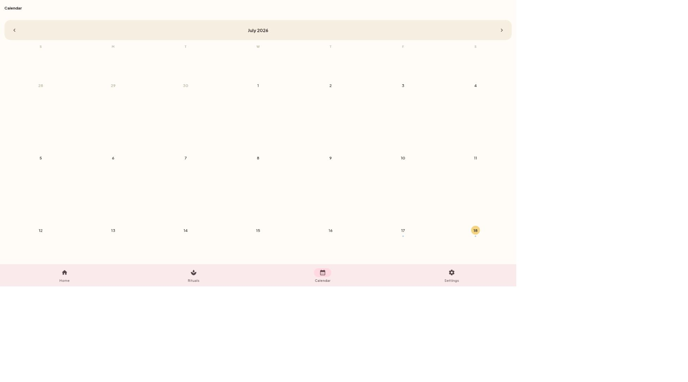
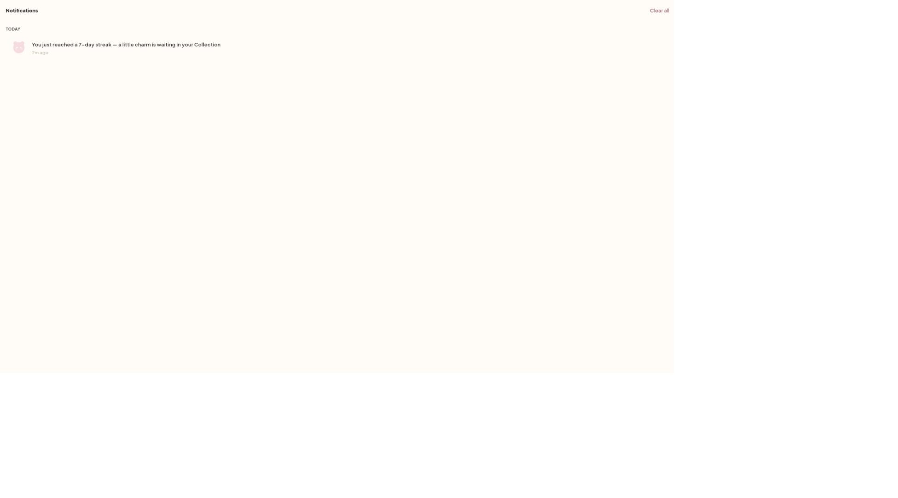
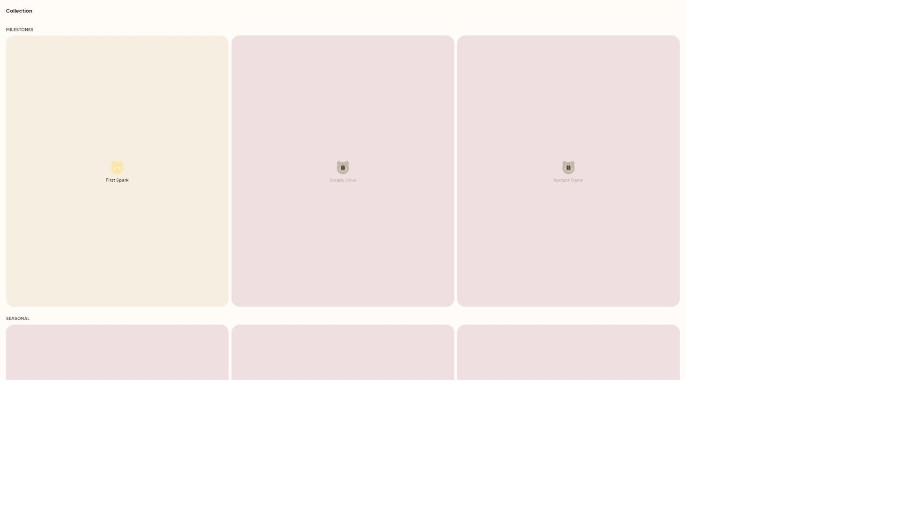
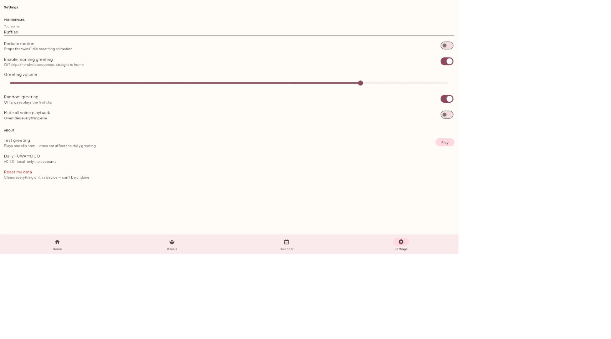

# Daily FUWAMOCO

A cozy, non-productivity companion app — a small twin-mascot pair that
greets you in the morning, keeps a gentle streak, and remembers a few
little rituals with you. Built as a personal/portfolio project with
Flutter, Riverpod, and go_router.

Not a habit-tracking power tool and not a social feed — the whole point
was to see how far a warm, quiet, "just for you" app could go without
leaning on gamification or productivity pressure.

## Screenshots

| | | |
|---|---|---|
|  Morning greeting |  Home |  Morning check-in |
|  Evening reflection |  Rituals (habits) |  Calendar |
|  Notifications |  Collection |  Settings |

## Features

- **Morning greeting** — once per calendar day, a short animated sequence
  (fade-in → text → voice clip → wallpaper → quote → streak/next stream),
  tap-to-skip, fails soft to visual-only if audio is unavailable.
- **Streak** — counts consecutive daily app opens.
- **Rituals (habit tracker)** — small recurring habits grouped by time of
  day, each with its own streak.
- **Calendar** — month view with an activity dot per day; tap a day to see
  what was done.
- **Morning check-in / Evening reflection** — a quick daily mood + note,
  independently completable.
- **Notifications** — in-app inbox, fires when your streak crosses a
  7/30/100-day milestone (no OS push — see [scope](docs/PRD-daily-fuwamoco-v2.md)).
- **Collection** — a small charm catalog; the Milestones group unlocks
  live from your streak.
- **Settings** — reduce motion, display name, greeting controls, and a
  "Reset my data" flow that returns the app to first-open state.

Everything is local-only (`shared_preferences`) — no accounts, no backend,
works fully offline.

## Stack

- Flutter, Riverpod (`flutter_riverpod`), go_router
  (`StatefulShellRoute.indexedStack` for the bottom nav)
- Storage: `shared_preferences` — flat keys for settings, plus a small
  JSON-list helper (`lib/core/storage/json_list_store.dart`) for the
  mutable structured data (habits, notifications, daily entries)
- Audio: `just_audio`, manifest-driven local clips
- All content (quotes, wallpapers, schedule, prompts, the collection
  catalog) is bundled JSON — never hardcoded strings

## Run it

```powershell
flutter run -d chrome              # real browser window
flutter run -d web-server          # headless, serves on localhost
flutter test                       # logic + widget tests
```

No Android/iOS SDK setup was done for this project — it was built and
verified entirely against the web target.

## Docs

- [`docs/PRD-morning-companion.md`](docs/PRD-morning-companion.md) — the
  original v1 spec (the morning greeting feature).
- [`docs/PRD-daily-fuwamoco-v2.md`](docs/PRD-daily-fuwamoco-v2.md) — the
  v2 redesign's scope, architecture decisions, and what was deliberately
  left out (real push notifications, a personality picker, reminder times).
- [`CLAUDE.md`](CLAUDE.md) — working rules this project was built under.

## Status

Feature-complete for the scope above. Not under active development —
built as a design/engineering exercise, not a shipping product.
